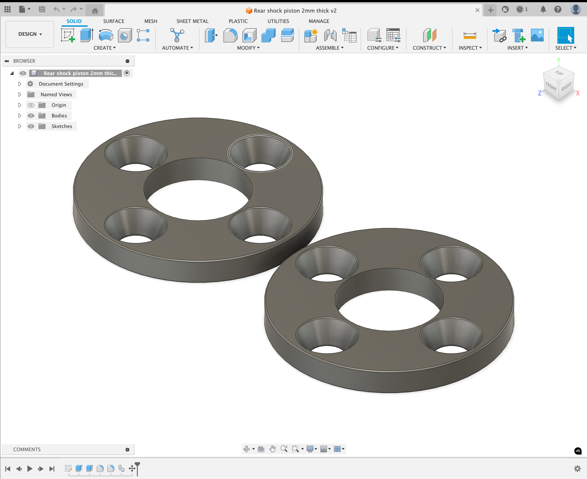
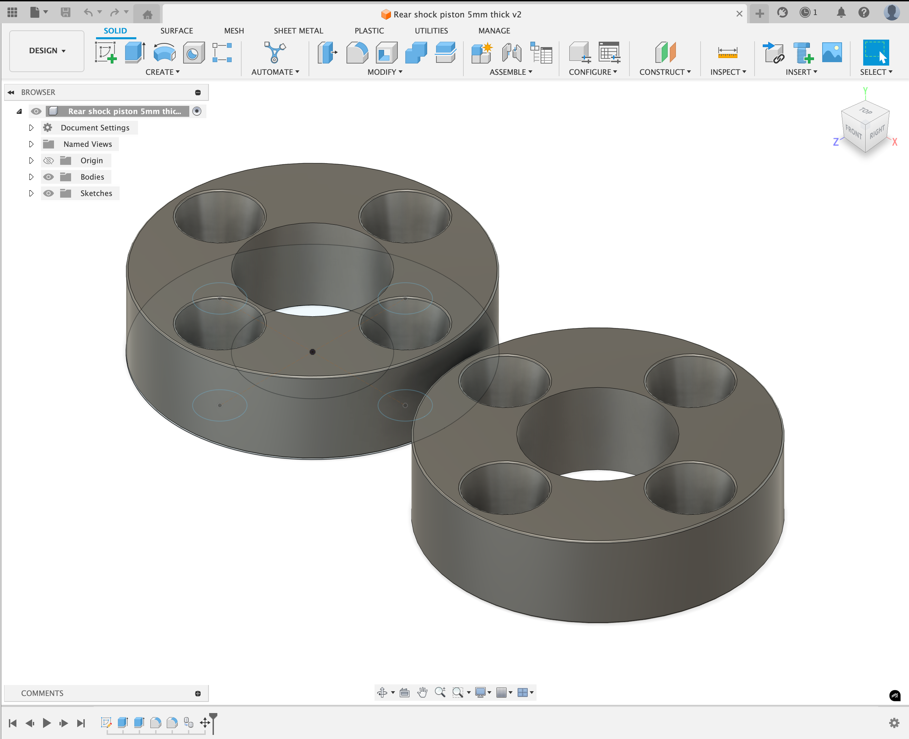
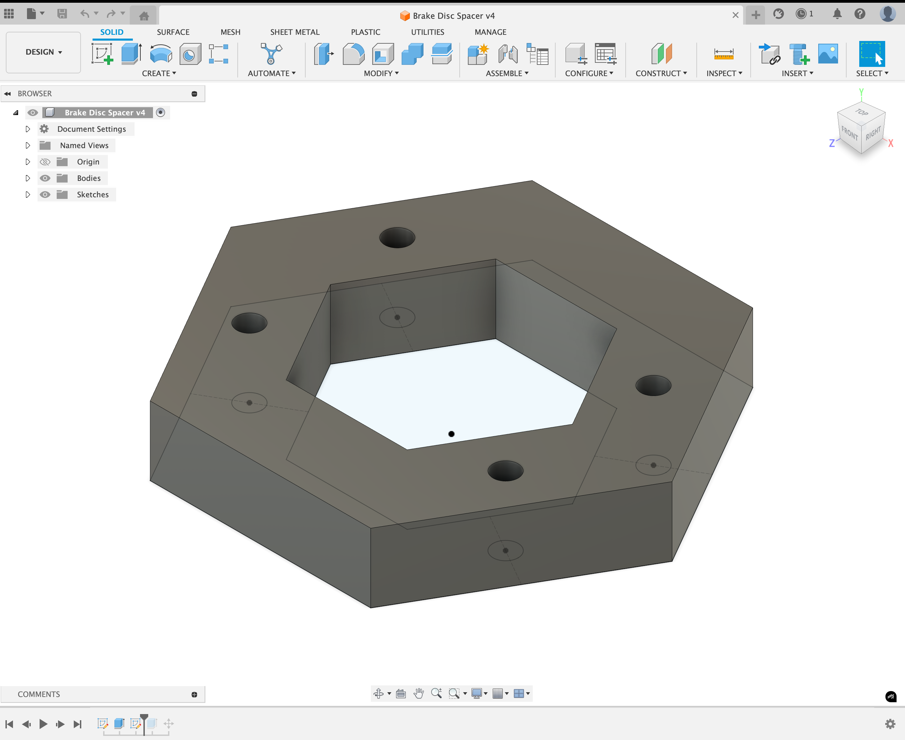
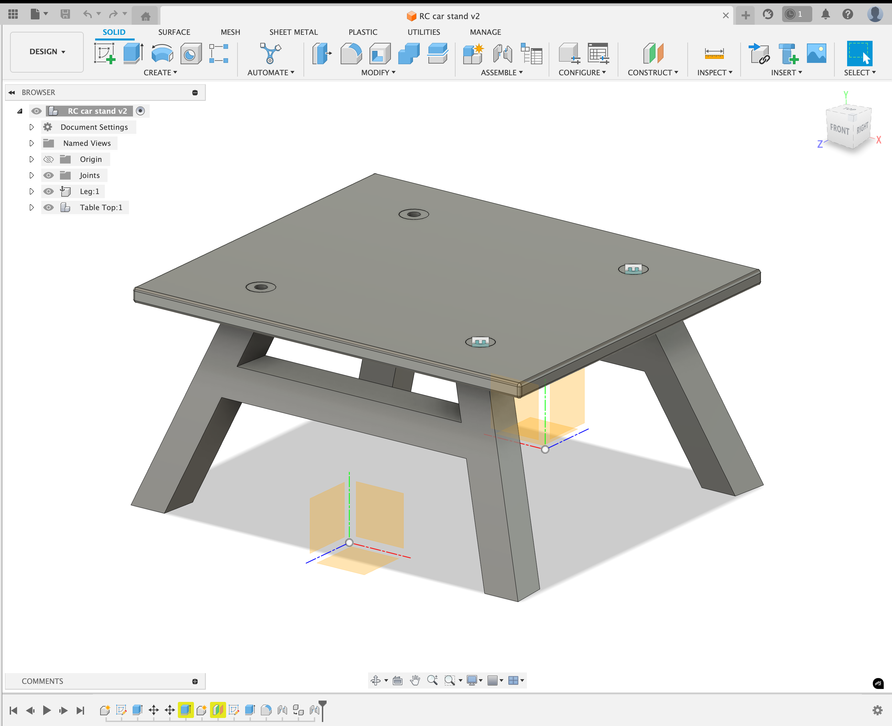

# 🛠 CAD Projects

Welcome to my collection of **CAD (Computer-Aided Design) projects**.  
This repository showcases my mechanical design, prototyping, and 3D modeling skills using tools such as *Fusion 360*.  

---

## 🔧 What You'll Find
Each project folder includes:
- **Source CAD files** (`.f3d`, `.sldprt`, `.step`)
- **Export files** for 3D printing (`.stl`)
- **Renderings** for visual previews

---

## 📂 Project Examples
- **Valved Shock Piston** – Performance-oriented designs with variable hole configurations for tuning rebound and compression.  
- **Brake Disk Spacer** – Custom-fit spacers to eliminate rotor vibration and improve durability.  
- **3D Printed Stand (RCStand)** – Custom R/C car stand for maintenance and display.  

---

## 🚀 Skills Demonstrated
- 3D Modeling & Parametric Design  
- Engineering Tolerances & Fits  
- Prototyping for 3D Printing & CNC Machining  
- Mechanical Visualization & Rendering  

## 📂 Project Examples

### Shock Piston Designs
- **Shock Piston 2mm**  
  
- **Files:**  
  - [STL File](<Rear shock piston 2mm thick v1.stl>)  
  - [F3D Source](<Rear shock piston 2mm thick v1.f3d>)

- **Shock Piston 5mm**  
  
- **Files:**  
  - [STL File](<Rear shock piston 5mm thick v2.stl>)  
  - [F3D Source](<Rear shock piston 5mm thick v2.f3d>)

### Brake Components
- **Brake Disk Spacer**  
  
- **Files:**  
  - [STL File](<BrakeDiskSpacer v2.stl>)  
  - [F3D Source](<BrakeDiskSpacer v2.f3d>)

### Accessories
- **RC Car Stand**  
  
- **Files:**  
  - [STL File](<RC car stand v1.stl>)  
  - [F3D Source](<RC car stand v1.f3d>)

---

## 🚀 Skills Demonstrated
- 3D Modeling & Parametric Design  
- Engineering Tolerances & Fits  
- Prototyping for 3D Printing & CNC Machining  
- Mechanical Visualization & Rendering  
---

## 🚀 Skills Demonstrated
- 3D Modeling & Parametric Design  
- Engineering Tolerances & Fits  
- Prototyping for 3D Printing & CNC Machining  
- Mechanical Visualization & Rendering  

---

## 📜 License
These designs are shared for educational and portfolio purposes.  
If you would like to use or modify them, please contact me first.
